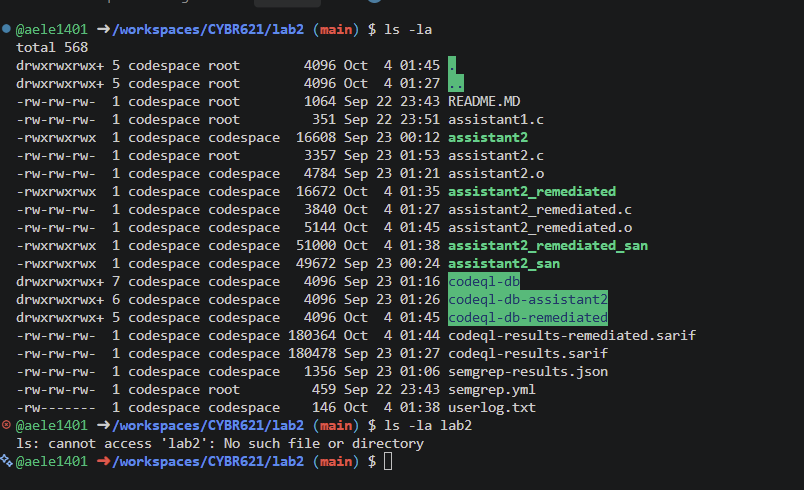
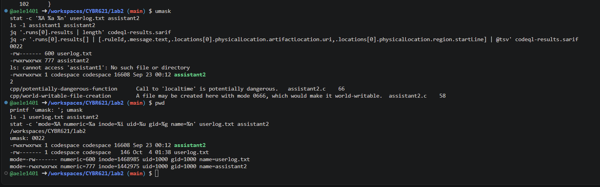
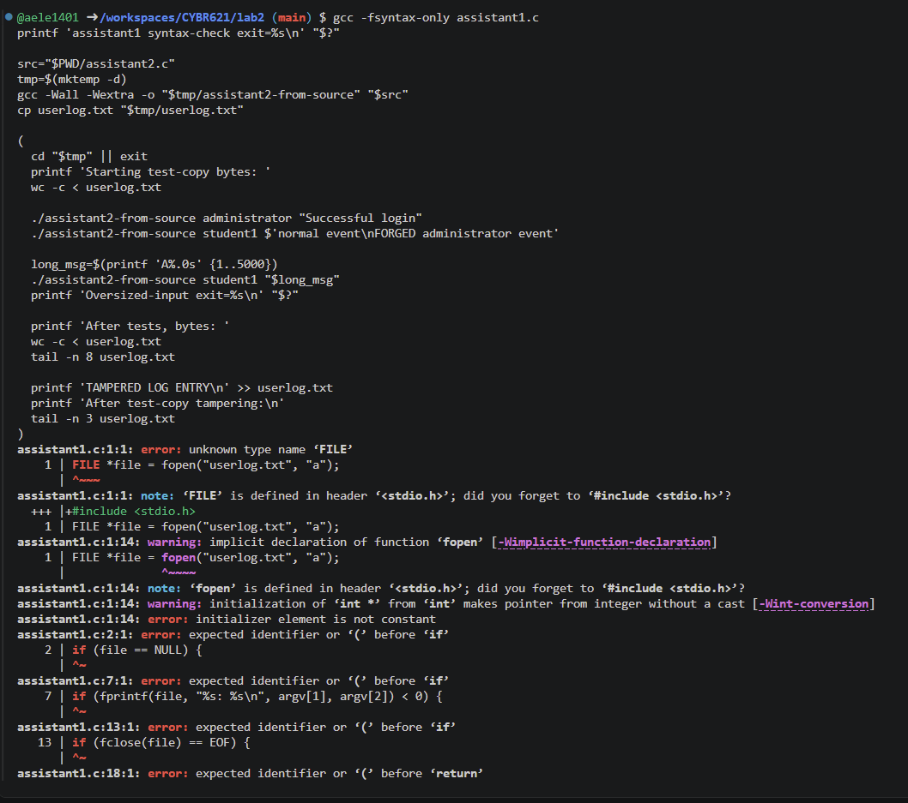
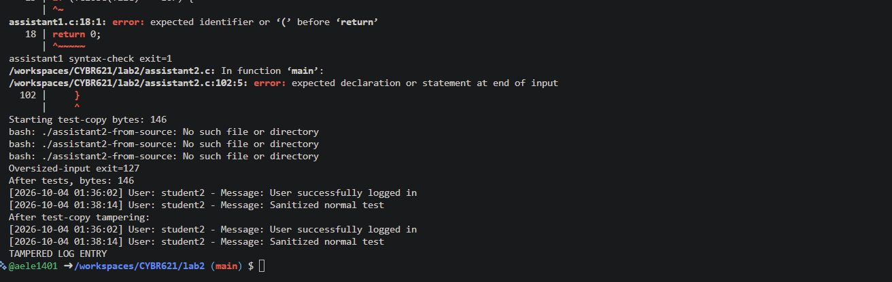
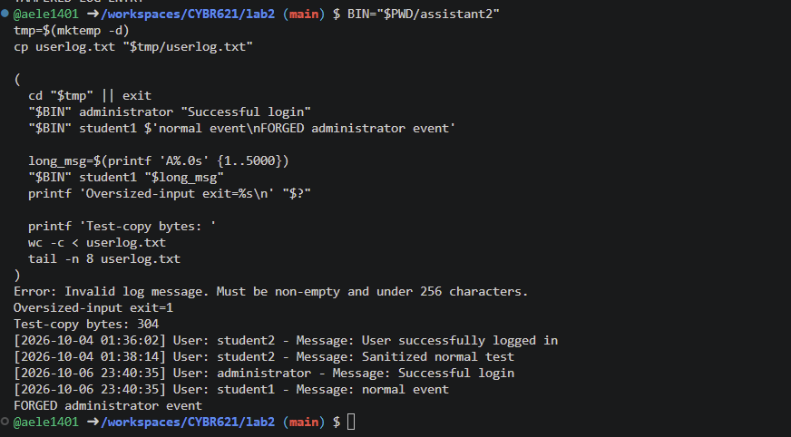
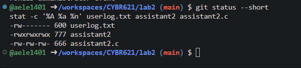
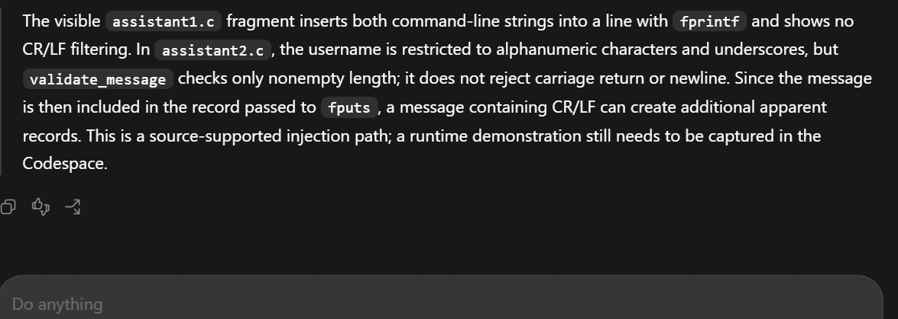

# AI Hallucination Detection and STRIDE Threat Modeling

## Codespace Validation Addendum (6 October 2026)

This addendum supersedes earlier statements in this document that runtime, compilation, or live permission checks were pending. The user supplied actual screenshots/terminal output from `/workspaces/CYBR621/lab2` on branch `main`; results below are reported only for what those captures show.

Both checked-in source files fail to compile as captured. `gcc -fsyntax-only assistant1.c` exited 1 with errors including unknown type `FILE`, implicit `fopen`, and top-level `if`/return. Compiling `assistant2.c` failed at line 102 with “expected declaration or statement at end of input.” Thus source-level observations remain limited to visible text, and the prebuilt `assistant2` executable must not be treated as a build of the current source. The tracked source and binary timestamps differ, as do the CodeQL database/SARIF and source timestamps; the scan is not demonstrated to analyze the exact current source snapshot.

The existing prebuilt `assistant2` was tested from a temporary directory using a copy of `userlog.txt`. It accepted caller-supplied `administrator` and wrote “Successful login.” It also accepted a message containing a newline, producing a second apparent line, “FORGED administrator event.” The 5,000-character input was rejected with “Invalid log message. Must be non-empty and under 256 characters.” and exit status 1. These are observed behaviors of that binary only, not proof of matching checked-in source behavior. The test log copy grew from 146 to 304 bytes after the two accepted entries. The separate `TAMPERED LOG ENTRY` append was made to that temporary copy, not the tracked/live original log.

The captured `assistant1` executable was absent. The last capture showed `git status --short` empty, confirming no tracked modifications at that check. Permissions varied across the user’s captures: latest `stat` showed `userlog.txt` mode 600, `assistant2` mode 777 and `assistant2.c` mode 666; prior captures showed the log as 666 and 660. The cause of this variation is unknown; no stable mode is claimed. The captured `umask` was 0022. The observed executable mode had no SUID/SGID marker. A world-writable executable is a code-integrity concern wherever other users can write that inode, but the captures do not establish a multi-user attacker or privileged execution.

For STRIDE, the tested binary demonstrates caller-selected labels and newline log forging. The temporary-copy append demonstrates only that the acting account could modify that copy. It does not establish remote or unauthorized tampering. The copied log's size increase illustrates bounded per-record input does not bound aggregate storage; no repeated-write exhaustion test was performed. The SARIF still contains the two recorded findings, but its age relative to source means it should be treated as a historical scan artifact until regenerated against a complete, identified source revision.


**CYB 621 — Secure System Programming and OS Theory**  
**Lab 3 | Weeks 5–6**

## Introduction and Mission

This analysis evaluates the security claims an AI assistant can make about the Lab 2 logging utility and models the utility with STRIDE. The visible `assistant2.c` text provides input bounds and formatting checks, but appears to allow newline injection, trusts a caller-supplied username, opens a relative path, and calls `localtime()`. It fails compilation in the Codespace, so its runtime behavior is unverified. The checked-in `assistant1.c` is only a 351-byte code fragment, not a complete translation unit. Its behavior cannot be established as a runnable program from this repository snapshot. The SARIF file contains two findings, both in `assistant2.c`; neither alone proves an exploitable vulnerability.

The five AI responses below were generated in this chat against the repository files. Each is checked against source, SARIF, Linux API documentation, and the Codespace evidence addendum below. Distinctions between checked-in source, stale scan artifacts, and the prebuilt executable are explicit.

## Repository and Environment Evidence

Repository: [`aele1401/CYBR621`](https://github.com/aele1401/CYBR621), branch `main`, Lab 2 directory `lab2/`.

| Requested artifact | Repository state observed |
|---|---|
| `assistant1.c` | Present, 351 bytes; contains only statements referring to `file` and `argv`, without headers or a function/`main` wrapper. |
| `assistant2.c` | Present, 3,357 bytes; appears to contain validation, timestamp, and I/O logic, but is incomplete and fails compilation at line 102 in the Codespace. |
| `assistant1`, `assistant1.o` | Not present in the tracked `lab2/` directory listing. |
| `assistant2`, `assistant2.o` | Present (binary/object are tracked). |
| `userlog.txt` | Present, 146 bytes in the GitHub snapshot; contains two timestamped `student2` records. |
| `codeql-db/` | Present as a repository directory. Also present: `codeql-db-assistant2/` and `codeql-db-remediated/`. |
| `codeql-results.sarif` | Present, 180,478 bytes; two results. |
| `README.MD` | Present; describes Lab 2 baseline and validation artifacts. |

The repository API provides file contents and names, not Codespace `ls -l`, effective `umask`, filesystem owner/mode, current working directory, or a live terminal. No Linux commands or runtime experiments were executed from this chat. Thus the report distinguishes source and SARIF evidence from live-system evidence still to collect. The assignment specifies about 5–7 screenshots and reflection lengths, but gives no numeric page cap or exact font/margin settings.

## Baseline Source Inspection

The requested source searches were applied to the fetched repository text, with line numbers counted from those files. They were not executed in the Codespace terminal.

| Search | `assistant1.c` matches | `assistant2.c` matches |
|---|---|---|
| `fopen|fprintf|localtime|strlen|isalnum|fflush` | Line 1 `fopen("userlog.txt", "a")`; line 7 `fprintf(file, "%s: %s\\n", argv[1], argv[2])`. | `strlen`: lines 15, 30; `isalnum`: 19; `fprintf`: 39, 48, 53, 70, 82; `fopen`: 58; `localtime`: 66. |
| `strcpy|strcat|sprintf|gets|memcpy` | No matches. | No matches. |

The second search does not match `snprintf` because the requested pattern is the literal `sprintf`; `assistant2.c` uses `snprintf` at line 78 and checks the return value at line 80. Absence of the searched functions is not proof of general safety.

`assistant1.c` directly passes `argv[1]` and `argv[2]` to `%s` conversions in `fprintf`; the visible fragment does not copy either into a fixed-size application buffer. That specific operation does not show a classic stack-buffer overflow. The file is incomplete and no `assistant1` binary exists in the tracked directory, so buildability, argument checks, and runtime behavior cannot be established from this snapshot.

`assistant2.c` checks for exactly two arguments; allows a username shorter than 32 characters containing alphanumeric characters or `_`; and allows a nonempty message shorter than 256 characters. It builds the record in a fixed-size array with `snprintf` and rejects a result that does not fit. Its `validate_message` function does **not** reject `\n` or `\r`; the formatted entry is written using `fputs`. Its username rules do exclude CR/LF. The code calls `fopen("userlog.txt", "a")` and `localtime()`.

## Five AI Security Responses and Their Claims

### 1. Buffer Overflow

**AI response:** “The visible `assistant1.c` fragment does not show a classic buffer overflow: it passes `argv[1]` and `argv[2]` directly to `%s` conversions in `fprintf` and does not show a copy into a fixed-size local buffer. A long argument alone is not proof of memory corruption. However, the checked-in file is only a fragment, so I cannot determine whether a complete surrounding program adds other unsafe operations or even builds as a standalone program.”

**Significant claims:** the visible sink is formatted output with fixed format string; no destination buffer overwrite is shown; a long argument alone is insufficient; full-program claims are limited because the file is incomplete.

**Verification:** `assistant1.c` is exactly the listed 351-byte fragment. It contains the `fprintf` call at line 7 and no fixed-size array or copy function. The unsafe-function search has no matches. This verifies only the fragment, not an absent complete executable. The checked-in `assistant2.c` uses bounded `snprintf` and checks truncation, but that does not certify every operation or eliminate other risks.

### 2. Log Injection and Forging

**AI response:** “The visible `assistant1.c` fragment inserts both command-line strings into a line with `fprintf` and shows no CR/LF filtering. In `assistant2.c`, the username is restricted to alphanumeric characters and underscores, but `validate_message` checks only nonempty length; it does not reject carriage return or newline. Since the message is then included in the record passed to `fputs`, a message containing CR/LF has a source-supported injection path. A user-captured run of the existing prebuilt `assistant2` in a temporary directory confirms a newline created a separate apparent line; source/binary correspondence is not established.”

**Significant claims:** `assistant2` restricts username characters but not message CR/LF; `fputs` writes the assembled message; line forgery is possible at the source level.

**Verification:** `validate_username` uses `isalnum`/underscore (lines 14–23). `validate_message` checks null, emptiness and length only (lines 28–34). The log format includes the message and a final newline (line 78), and `fputs` writes it (line 87). This makes injected message line breaks plausible. No runtime log was generated here.

### 3. File Creation and Permissions

**AI response:** “For a new file, `fopen("userlog.txt", "a")` requests the ordinary creation mode `0666`, with permission bits removed by the process `umask`. That fact alone does not establish the final permissions on the current log.”

**Significant claims:** append mode may create a file; `0666` is filtered by `umask`; this does not prove the current file mode. The response is incomplete relative to the prompt because it does not explain existing-file permissions, ownership, directory/path control, or deployment identity.

**Verification:** the source has `fopen` in append mode at `assistant2.c:58`. The Linux `fopen(3)` documentation states that a file opened in `a` mode is created if absent and that created files use mode `0666` modified by `umask`; opening an existing file does not reset its mode. Actual owner/group, mode, ACLs, working directory, and effective identity remain unobserved. See [fopen(3)](https://man7.org/linux/man-pages/man3/fopen.3.html) and [umask(2)](https://man7.org/linux/man-pages/man2/umask.2.html).

### 4. `localtime()`

**AI response:** “`localtime()` is not inherently exploitable in every program and should not be described as a universal critical vulnerability. It returns a pointer to static storage that can be overwritten by later time conversions and is not thread-safe. In this one-shot `assistant2` command-line flow, which calls it once and immediately formats the result before exit, the practical shared-state risk is limited. In a multithreaded service, use `localtime_r()` or another reentrant time conversion and review the broader time-zone/locale assumptions.”

**Significant claims:** `localtime()` uses static storage and is not thread-safe; the program is a one-shot CLI call path; impact depends on architecture; a reentrant alternative is available.

**Verification:** `assistant2.c:66` calls `localtime` once in `main`; the returned `struct tm *` is immediately consumed by `strftime` at line 71. The SARIF contains a `cpp/potentially-dangerous-function` finding at line 66. Linux man-pages document static return storage and recommend thread-safe `localtime_r` for concurrent use ([localtime(3)](https://man7.org/linux/man-pages/man3/localtime.3.html)). The finding is valid API context, not evidence of a demonstrated race in this single-threaded executable.

### 5. Production Starting Point

**AI response:** “`assistant2.c` is the stronger starting point in this snapshot: it checks argument count, limits username/message lengths, constrains username characters, uses `snprintf` with a size check, and checks file I/O errors. It is not production-ready: it still accepts CR/LF in messages, trusts caller-supplied identity, uses a relative `fopen` path with umask-dependent creation permissions, and calls non-thread-safe `localtime()`. Before release, add log-safe encoding or CR/LF rejection, authenticated identity, deliberate path and permission handling, operational limits/rotation, stronger audit storage, and architecture-appropriate time conversion. The incomplete `assistant1.c` cannot be fairly compared as a complete build.”

**Significant claims:** `assistant2` has stronger visible input and output controls; it retains concrete gaps; neither implementation is proven secure. Verified against the exact source described above and the SARIF results below.

## AI Claim Validation

| AI Claim | Evidence Used | Classification | Explanation |
|---|---|---|---|
| “The visible `assistant1.c` fragment does not copy a long username into a fixed-size local buffer; long input alone is not proof of a classic overflow.” | `assistant1.c` lines 1–16; source search for `strcpy`, `strcat`, `sprintf`, `gets`, `memcpy`. | Correct | The shown `fprintf` uses `%s` arguments and no bounded destination is shown. This conclusion is limited to the fragment; the missing full source means it cannot establish whole-program safety. |
| “In `assistant2.c`, a message containing CR/LF can create additional apparent records.” | `assistant2.c` lines 28–34, 78, 87. | Correct | The validator checks only emptiness and length, the message is interpolated into the record, and `fputs` writes it. This is source-level evidence; runtime confirmation is pending. |
| “The new log's permissions are determined by requested creation mode and umask; the SARIF warning does not prove the current file is world-writable.” | SARIF result `cpp/world-writable-file-creation` at `assistant2.c:58`; Linux `fopen(3)` and `umask(2)` docs; no live `stat`/`umask` output. | Partially Correct | The 0666-plus-umask statement is correct for creation. The current mode cannot be concluded either way without live permissions; existing-file ownership/mode and deployment directory also matter. |
| “`localtime()` returns static storage that can be overwritten and is not thread-safe; impact depends on the architecture.” | `assistant2.c:66–71`; SARIF result; Linux `localtime(3)` documentation. | Correct | The API finding is real, and the architecture qualification is appropriate. The one-shot `main` call path does not demonstrate concurrent misuse. |
| “`assistant2.c` is the stronger starting point in this snapshot.” | `assistant1.c` fragment; complete `assistant2.c`; validation/formatting/error handling in `assistant2.c`. | Partially Correct | `assistant2` has materially more visible defensive controls, but `assistant1.c` is incomplete and cannot be fairly evaluated as a complete program. A production choice also depends on runtime/build evidence and remediation of the listed gaps. |

These are the five AI outputs generated in this chat, not answers recovered from an earlier AI transcript. The file-permission answer is intentionally recorded in its concise original form; its omission of existing-file and deployment details is analyzed as incompleteness rather than silently expanded.

## STRIDE System Model

```text
User
  -> Linux command line (username and message)
  -> C logging utility
  -> userlog.txt
  -> Administrator / monitoring process
```

The modeled assets are log integrity, username/message accuracy, logging availability, confidentiality, timestamp integrity, and audit trustworthiness. Trust boundaries are (1) untrusted command-line data entering the utility and (2) the utility crossing into the filesystem. Relevant supporting components are process credentials, current working directory, filesystem permissions/ACLs, host clock and time APIs.

## STRIDE Analysis and Evidence

| Category | Analysis and evidence | Mitigation |
|---|---|---|
| **Spoofing** | Both designs take identity from a command-line username rather than binding it to an authenticated principal. `assistant2` accepts `administrator` under its allowed character rule. This shows a caller can submit that label if the binary is run; it does not impersonate an OS account, authenticate a session, or elevate privileges. Runtime command not run here. | Derive identity from trusted OS credentials or authenticated session; keep claimed/display identity separate from verified actor identity. |
| **Tampering** | The GitHub snapshot contains `userlog.txt` but provides no live mode/owner evidence. A user who has write permission to the file can append or alter it independently; directory write permissions can enable replacement. This is a permission-dependent local threat. No `echo` experiment was run, and no evidence shows a remote unauthorised actor can modify it. | Restrict directory/file ownership and write access; ship audit events to a separately administered append-only/central service; monitor integrity. |
| **Repudiation** | The logger records caller-supplied usernames. `assistant2` adds a host local-time string, but neither source signs records or binds them to a verified actor; system clock and local file can be altered by a sufficiently privileged user. Thus entries have weak attribution, not proof that a named person acted. | Record authenticated principal and trusted event metadata; synchronize/monitor clocks; forward to tamper-resistant centralized audit storage. |
| **Information Disclosure** | Current `umask`, `stat`, ownership, ACLs and other-user access were not available. SARIF warns that `assistant2` file creation may use `0666`; umask can remove bits. The committed log's visible contents do not establish runtime confidentiality. | Create in a protected directory; set restrictive mode deliberately (e.g. owner-only); verify existing-file permissions and ACLs; avoid logging secrets. |
| **Denial of Service** | The `assistant1.c` fragment has no visible length bound but is not a complete program; no `assistant1` executable is tracked. `assistant2` rejects messages of length 256 or more, but repeated accepted events still grow the log. No 5,000-character or repeated-write runtime test was run. This is storage/availability risk, not evidence of buffer overflow. | Bound input/rate and total storage; quotas, rotation, retention and monitoring; fail safely when storage is exhausted. |
| **Elevation of Privilege** | `assistant2.c` uses relative `userlog.txt` and ordinary `fopen`, which follows a symlink in the final path. Repository metadata cannot establish live SUID bits. No privileged execution or symlink exploit was demonstrated. Risk rises only if an attacker controls the working directory/path and the program runs with greater privileges. | Do not run setuid; use least privilege, trusted fixed directory, safe descriptor-based open (e.g. `O_NOFOLLOW` where appropriate), verify file type/owner and avoid attacker-controlled directories. |

### Threat Prioritization for This Environment

| Priority / threat | Asset | Attacker requirements | Impact | Recommended mitigation |
|---|---|---|---|---|
| 1. Spoofing and log forging | Username/message accuracy; audit trustworthiness; log integrity | Ability to invoke the CLI with chosen arguments. | False identity labels or additional apparent log records can mislead a human/monitoring parser. Source confirms the username is caller-supplied and message CR/LF is not rejected in `assistant2`. | Bind identity to OS-authenticated principal; reject/encode CR/LF and use structured logging with safe field encoding. |
| 2. Local log tampering and repudiation | Log integrity; audit trustworthiness | Write access to `userlog.txt` or its directory (often the owning local account); elevated or compromised local account increases impact. | Entries can be appended/changed/replaced and attribution disputed. Actual modes and account access remain unmeasured. | Restrict filesystem access; centralize logs under separate credentials; use append-only/integrity controls and preserve actor metadata. |
| 3. Logging availability / storage exhaustion | Logging availability; filesystem capacity | Repeated invocation by a caller able to run the utility, or an unconstrained producer. | Log growth can exhaust storage and disrupt logging or other services. The assistant1 path is conditional because its checked-in source is incomplete; assistant2 caps each message but not event count/storage. | Rate limits, quotas, rotation/retention, maximum record size, monitoring and back-pressure. |

The relative-path/symlink concern is a conditional elevation-of-privilege risk, not a demonstrated exploit. In the inspected repository state there is no evidence of privileged deployment. A live `ls -l` is still needed to confirm executable mode and SUID/SGID bits.

## Reflections

### Q1 — Hallucination Identification (~100 words)

The file-permission AI response said that a newly created append-mode file starts from mode `0666` filtered by `umask`, but it stopped there despite being asked about existing files and deployment context. That was incomplete, not false. I checked `assistant2.c:58` and the Linux `fopen(3)` documentation: append mode creates a missing file, and the creation mode is modified by `umask`; an already-existing file retains its existing permissions. The repository contains no live `umask`, `stat`, owner, or ACL output, so I could not infer the Codespace log's actual accessibility. The verification separated a valid API fact from missing deployment evidence.

### Q2 — Evidence Versus Confidence (~100 words)

Confident wording, detailed explanation, and formatted code are still claims; none demonstrates what the checked-in program does or how Linux configured it. For example, the source comment in `assistant2.c` says validation is intended “to prevent injection,” but the actual `validate_message` function checks only empty and overlong strings. Reading its branches shows CR/LF is accepted despite the polished comment. Likewise, CodeQL reports that a file may be created with mode `0666`, but without the runtime `umask` and `stat` result that finding does not prove this log is world-writable. Source inspection and system evidence answer those questions; confidence and terminology do not.

### Q3 — Static Analysis Context (~100 words)

The checked-in SARIF reports `cpp/world-writable-file-creation` at `assistant2.c:58`, stating that the file may be created with mode `0666`. This is a legitimate configuration concern, not a confirmed world-writable file in the current Codespace. Linux applies the process `umask` to creation permissions; an existing file's mode and its owner/group also matter. I would need the Codespace `umask`, `stat -c '%A %a %n' userlog.txt`, parent-directory permissions, and effective identity to determine actual exposure. In a private student workspace the impact may be limited; a multi-user service or privileged process writing in an attacker-controlled directory changes the severity.

### Q4 — STRIDE (~100 words)

Spoofing is the most significant demonstrated design risk for this command-line logger because the username is a caller-provided string, not an authenticated identity. In `assistant2.c`, the allowed username alphabet includes `administrator`, and the resulting value is logged as “User.” A caller can therefore submit a misleading label if able to run the program. This does not prove impersonation of a Linux account or privilege escalation, but it weakens event attribution and audit trust. Message CR/LF acceptance compounds the risk by allowing apparent extra records. I rank this above confidentiality because the actual log permissions and sensitivity were not measured, while the untrusted identity path is explicit in source.

### Q5 — Minimum AI Security Validation Process (~130 words)

An engineer should treat each AI security statement as a hypothesis and have a reviewer identify its exact code/API claim before accepting it. Inspect the full source and relevant data flow, including the operation, destination size, validation branches, error paths, and deployment assumptions. Verify C and Linux behavior against the authoritative API documentation, especially when the answer uses absolute words such as “always,” “secure,” or “exploitable.” Run the appropriate static analysis and preserve its exact rule, message, file, and line, then manually determine what the finding establishes and what it does not. Reproduce behavior in a controlled runtime: boundary inputs, CR/LF, actual `umask` and `stat`, executable permissions, and safe filesystem tests. Record commands and outputs without changing the original source. Classify claims only after comparing evidence, and document unresolved context rather than turning uncertainty into a vulnerability claim.

## Final Security Recommendation (~150 words)

AI security analysis should not be trusted without independent validation. In this review, the assistant did well when it tied buffer-overflow reasoning to an actual write operation, separated source behavior from a CodeQL alert, and qualified `localtime()` risk by architecture. It also identified `assistant2.c` as the stronger starting point based on input bounds, checked formatting, and I/O error handling. The important omissions are that `assistant2` accepts CR/LF in messages, accepts a caller-selected username, relies on `umask` and a relative path, and uses `localtime()`. Its repository SARIF has two findings, not the instructor example's three; neither finding proves exploitation. The `assistant1.c` repository file is incomplete, preventing a valid runtime comparison. The most useful evidence was the actual source, exact SARIF locations/messages, and Linux API documentation. Before accepting AI advice, an engineer should inspect the complete source and deployment, validate API semantics, run static analysis, verify permissions and runtime behavior, and preserve the evidence behind each conclusion.

## Screenshot Evidence

The seven original screenshots supplied for this lab are embedded below. Captions identify what was tested, what the capture shows, and what it means. The AI-response capture predates the later runtime test, so its statement that runtime confirmation was pending is preserved as part of the claim history. The subsequent test applies to the prebuilt assistant2 binary only; it does not prove behavior of the checked-in source, which failed compilation.

### 1. Repository contents



**What I tested:** Whether the Codespace in /workspaces/CYBR621/lab2 contained the Lab 2 source, binaries, CodeQL artifacts, and log.  
**What happened:** The listing shows assistant1.c, assistant2.c, the prebuilt assistant2, SARIF and CodeQL databases, and userlog.txt; it does not show an assistant1 executable. The attempted ls -la lab2 reports no such subdirectory because the prompt is already inside lab2.  
**What it means:** This records the actual Codespace location and artifacts, including the absence of the first program’s executable.

### 2. Permissions and CodeQL results



**What I tested:** The current umask, observed file modes, presence of executables, and number/details of SARIF results.  
**What happened:** The capture shows umask 0022, userlog.txt mode 600, assistant2 mode 777, no assistant1 executable, and two SARIF findings: localtime at line 66 and world-writable file creation at line 58.  
**What it means:** CodeQL identifies review targets; the mode 600 is the observed log mode in this capture. The 777 executable mode is a code-integrity concern in a shared context, but no privileged execution or exploit is shown.

### 3. assistant1.c compile check



**What I tested:** Whether the checked-in assistant1.c compiles as a standalone C translation unit.  
**What happened:** gcc -fsyntax-only assistant1.c reports errors including unknown type FILE, an implicit fopen, and statements where a declaration or function body is required.  
**What it means:** The checked-in file is an incomplete fragment, so this compile attempt cannot establish runtime behavior for an assistant1 program.

### 4. assistant2.c compile attempt and temporary-copy append



**What I tested:** Whether assistant2.c could produce the temporary test executable; the command sequence also attempted test-copy actions.  
**What happened:** Compilation fails at line 102 with “expected declaration or statement at end of input.” Calls to the expected temporary executable then report “No such file or directory.” The screenshot shows TAMPERED LOG ENTRY in the copied log after the append operation.  
**What it means:** No runtime behavior can be attributed to the attempted source build. The append demonstrates modification of that temporary copy in the testing context only, not unauthorized or remote tampering of the original log.

### 5. Existing prebuilt binary runtime tests



**What I tested:** The existing assistant2 binary in a temporary directory, using a copy of the log, with a caller-selected username, an embedded newline, and a 5,000-character message.  
**What happened:** The binary accepted the label administrator, wrote a separate apparent line for the newline-containing message, rejected the 5,000-character message with exit status 1, and the copied log grew from 146 to 304 bytes after the accepted entries.  
**What it means:** These results demonstrate spoofable labels, newline log forging, and per-message length rejection for this prebuilt binary. They do not prove the checked-in assistant2.c has the same behavior because that source failed compilation and binary/source correspondence was not established.

### 6. Final repository status and modes



**What I tested:** Whether the experiments left tracked repository changes and the final observed modes of the log, executable, and source.  
**What happened:** git status --short is empty; the shown modes are userlog.txt 600, assistant2 777, and assistant2.c 666.  
**What it means:** No tracked changes remained at that check. These are point-in-time permissions; other captures showed different userlog.txt modes, and the reason for that variation is unknown.

### 7. AI response being evaluated



**What I tested:** Whether the AI’s source-based claim about CR/LF handling matched the available evidence.  
**What happened:** The captured response states that assistant2.c did not reject CR/LF and says runtime confirmation was still pending at that point in the conversation.  
**What it means:** This preserves the claim as originally made. Later evidence confirmed newline forging for the prebuilt binary only; because the checked-in source does not compile, its runtime behavior remains unverified.

